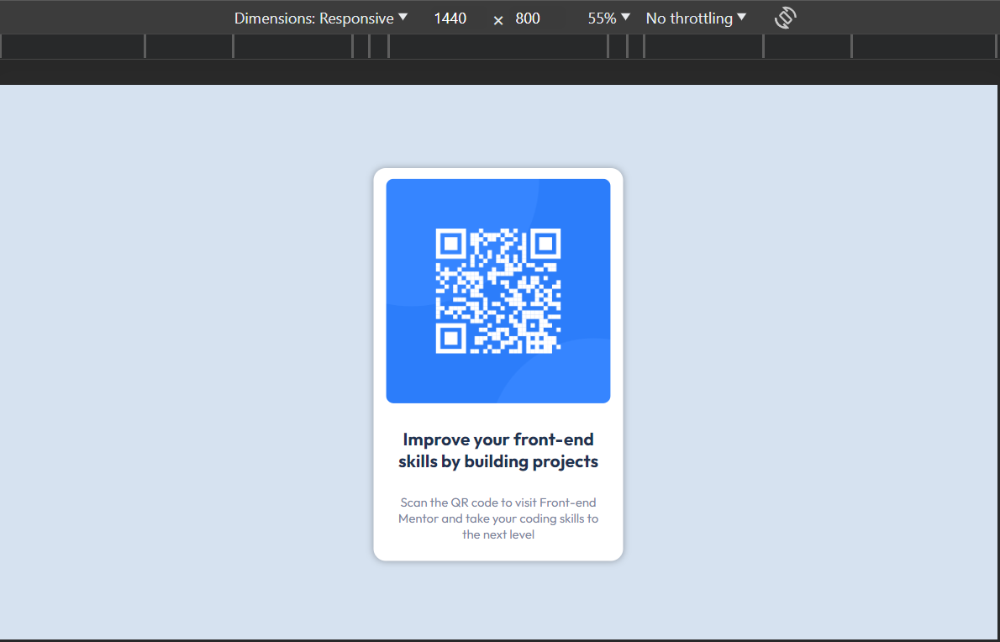
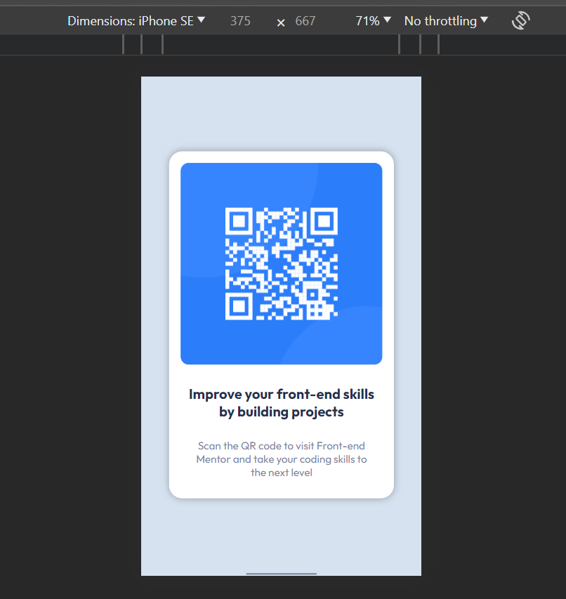

# Frontend Mentor - QR code component solution

This is a solution to the [QR code component challenge on Frontend Mentor](https://www.frontendmentor.io/challenges/qr-code-component-iux_sIO_H). Frontend Mentor challenges help you improve your coding skills by building realistic projects. 

## Table of contents

- [Overview](#overview)
  - [Screenshot](#screenshot)
  - [Links](#links)
- [My process](#my-process)
  - [Built with](#built-with)
  - [What I learned](#what-i-learned)
  - [Continued development](#continued-development)
  - [Useful resources](#useful-resources)
- [Author](#author)


## Overview

The is the solution to the [QR code component challenge on Frontend Mentor], coded by clintt-09. Below are the screenshots of designs coded with HTML and CSS. 

There are a total of two screenshots; the Desktop and Mobile views respectively. There are also links to the github repository and the live site hosted on GitHub Pages.

### Screenshot

Desktop view (1440 x 800)


Mobile view (375 x 667)


### Links

- Solution URL: [github.com/eghosaclinton/eghosaclinton.github.io](https://github.com/eghosaclinton/eghosaclinton.github.io)
- Live Site URL: [eghosaclinton.github.io](https://eghosaclinton.github.io/)

## My process

  Below are tools/ technologies I used to tackle this challenge, lessons that were learnt during the process of solving the problem, areas that I yearn to get better in the near future and articles that helped me and may help others to tackle this challenge(or Other ones) on Frontend Mentor.

  This is the Process I followed to tackle this challenge.
### Built with

- Semantic HTML5 markup
- CSS custom properties
- CSS Media queries

### What I learned

I am not new to CSS and thus, I have a firm grasp on generic CSS properties and its apppliications. However, I have a hard time with few aspects in CSS. One of which is Responsive Design.

I was told it is not a complex concept and therefore I took my time with this challenge to learn and be able to do this without much difficulty. One way to design responsively in CSS is with Media queries.

This challenge made me finally tackle this issue and I was successfully able to use media queries in my Solution.

Here is a CSS media query that was used in my solution below:

```css
@media (max-width: 376px) {
    .container{
        width: 80%;
        margin: 15vh auto;
    }

    .first-p{
        font-size: 1.25em;
    }

    .second-p{
        font-size: .95em;
    }
}
```

The above Snippet was used to ensure my solution was viewable on mobile. 

### Continued development

I believe I stil fall short when it comes to Responsive design. I am still learning to do this and I believe with more and more challenges solved, I will finally be able to design pages for any screen size without much trouble.

### Useful resources

- [MDN Web Docs](https://developer.mozilla.org/en-US/) - This is was a clear and concise documentation that helped me lots during this challenge. I believe every web developer is familiar with it but I still need to mention it in case.
- [A Complete Guide to CSS Media Queries by css-tricks](https://css-tricks.com/a-complete-guide-to-css-media-queries/) - This article helped me understand Media queiries to a decent degree and helped me make my solution Mobile friendly. I recommend to anyone struggling with Media queries.

## Author

- Frontend Mentor - [@clintt-09](https://www.frontendmentor.io/profile/clintt-09)
- Twitter - [@clinttfr](https://www.twitter.com/clinttfr)